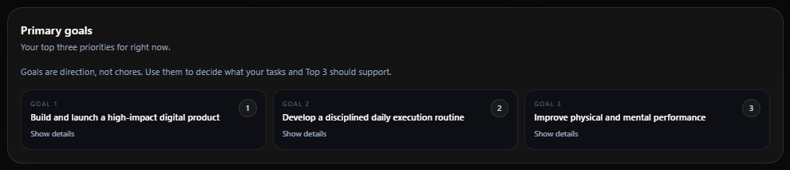
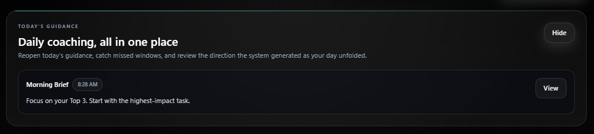
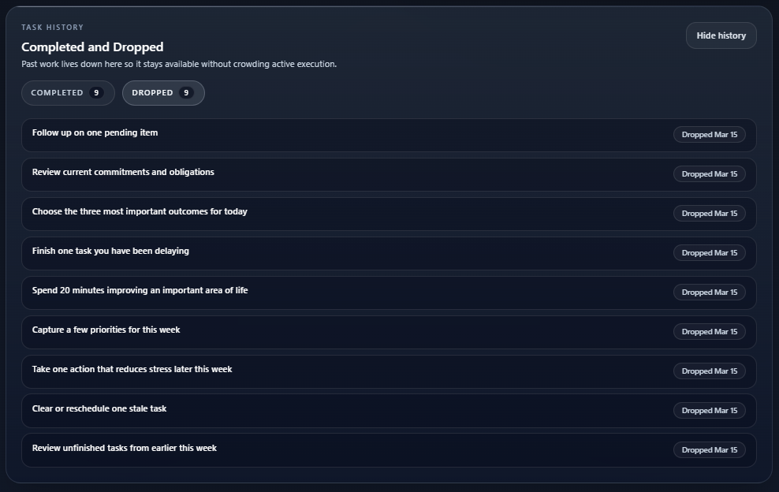
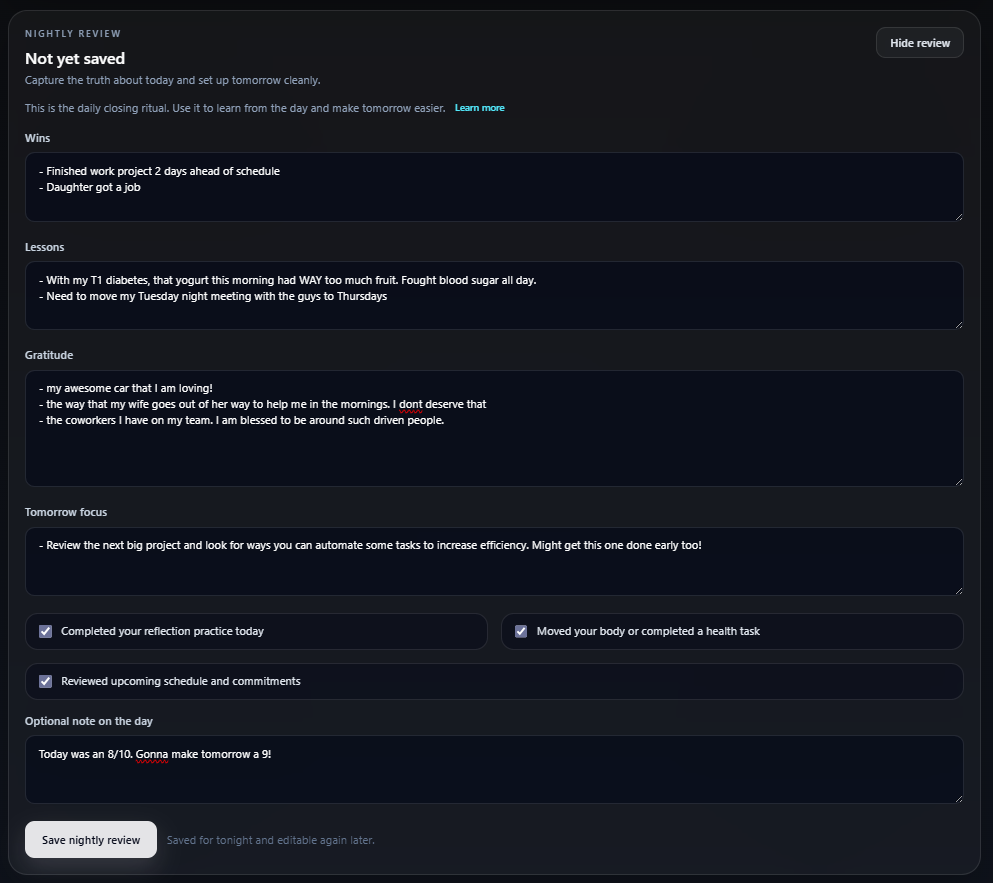

  

<h1 align="center">Outcomes OS</h1>

  <strong>Protect the work that matters. See drift early. Correct the week before it disappears.</strong>

  <a href="https://outcomesos.com"><strong>Explore Outcomes OS</strong></a>
  &nbsp;·&nbsp;
  <a href="https://app.outcomesos.com/signup">Start the free trial</a>

---

## Most people are not lazy. They are drifting.

Capable people rarely run out of ambition. They lose important work inside weeks crowded by urgent requests, scattered priorities, unfinished tasks, and constant restarting.

A task manager can record the activity. It cannot tell you whether the work that matters is surviving the week.

**Outcomes OS is a weekly execution operating system for founders, operators, entrepreneurs, consultants, and ambitious professionals who need a reliable way to turn priorities into progress.**

It connects one protected weekly outcome to daily commitments, focused execution, honest signals, and deliberate correction.

## The Weekly Execution Loop

Outcomes OS runs on a closed execution loop:

1. **Protect the outcome**  
   Choose the one meaningful result the week cannot afford to lose.

2. **Commit the day**  
   Translate that outcome into a realistic Daily Top 3.

3. **Run the work**  
   Execute from one Command Center instead of chasing scattered lists.

4. **Read the signals**  
   Capture what is helping, blocking, changing, or pulling the week off course.

5. **Correct the week**  
   Review the evidence, recover strategic work, and make the next plan smarter.

Recovery is part of the system. Outcomes OS is designed for real weeks that change, not perfect weeks that exist only on paper.

## Command Center

The Command Center keeps the active week visible. Priorities, commitments, tasks, guidance, and execution signals meet in one operating surface.

## Daily Top 3

The Daily Top 3 forces a decision before urgency makes it for you. It narrows the day to the commitments most connected to the outcome you are protecting.

## Guidance That Supports Action

Guidance exists to clarify the next move, expose tradeoffs, and help the user recover focus. It supports the execution loop without replacing judgment.

## Task Reality and Drift Signals

A full list can create the illusion of progress. Outcomes OS makes unfinished work, overload, avoidance, and repeated drift harder to ignore.

## Daily and Weekly Correction

Every execution cycle closes with evidence. Users identify what advanced, what drifted, why it happened, and what needs to change next.

## What makes it different

Outcomes OS is built around behavior and correction, not task storage alone.

- One weekly outcome establishes direction.
- The Daily Top 3 converts direction into commitment.
- The Command Center keeps active work visible.
- Signal capture replaces unreliable memory.
- Power Hour recovery protects strategic work.
- Daily and weekly reviews close the loop.
- Execution insights reveal patterns over time.

The goal is not a larger dashboard. The goal is to become an operator who can trust the way the week is run.

## Public system documentation

This showcase explains the product and its system design without exposing private production implementation.

- [System overview](docs/system-overview.md)
- [Execution model](docs/execution-model.md)
- [Architecture](docs/architecture.md)
- [Product direction](docs/roadmap.md)

## Production stack

- Next.js App Router
- TypeScript and React
- Supabase and PostgreSQL
- Stripe
- Server Actions
- Analytics and execution guidance
- Vercel deployment with Cloudflare at the domain edge

## Product links

- **Marketing and product education:** [outcomesos.com](https://outcomesos.com)
- **Authenticated application:** [app.outcomesos.com](https://app.outcomesos.com)
- **Start the trial:** [app.outcomesos.com/signup](https://app.outcomesos.com/signup)

---

  <strong>Protect the outcome. Run the work. Read the signals. Correct the week.</strong>

