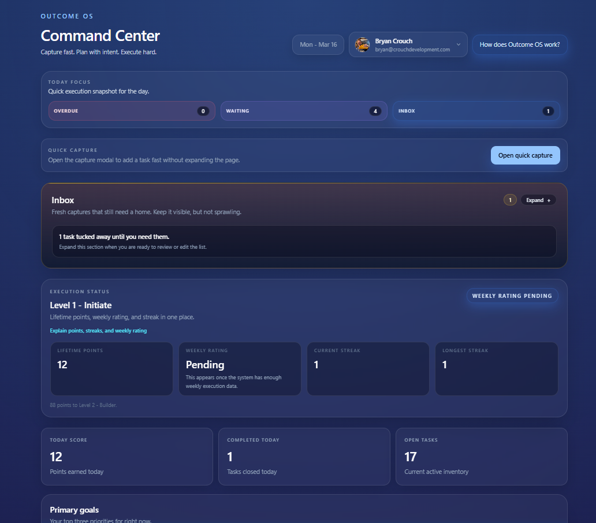

# Outcome OS

Outcome OS is a personal operating system for disciplined execution.

The production application is private.

Live system:
https://outcomes.crouchdevelopment.com

---

## Overview

Outcome OS helps operators structure their life and work through:

- goals
- daily execution
- weekly planning
- nightly review
- feedback loops

---

## Technology Stack

Next.js  
Supabase  
Stripe  
PostgreSQL  
Vercel  

---

## Architecture

See:

docs/architecture.md

---

## Execution Model

See:

docs/execution-model.md

---

## Screenshots

Examples:

Command Center  
Daily Review  
Insights Dashboard  

---

## Status

Production SaaS  
Source code private

---

Built by Bryan Crouch

https://crouchdevelopment.com
Architecture and system documentation for Outcome OS
