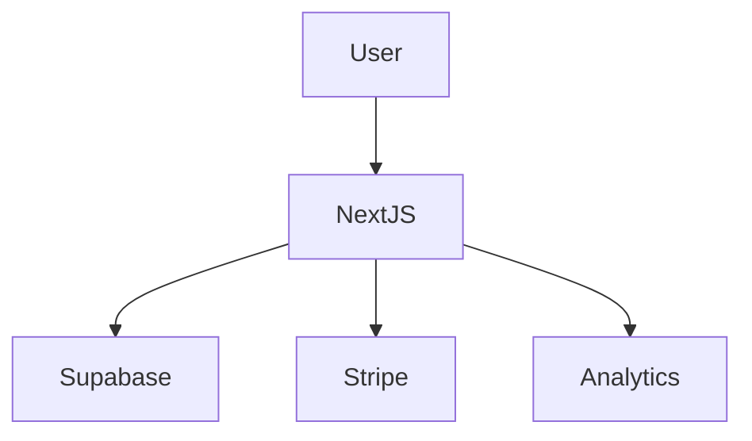

# Architecture

Outcome OS uses a modern web application architecture centered on a Next.js frontend and a managed backend stack. The user interacts with the application through a responsive web interface built in Next.js. Application state, authentication, and structured product data are supported through Supabase and PostgreSQL. Billing and subscription workflows are handled through Stripe, while analytics systems capture product usage and behavioral signals for insight generation.

This public repository intentionally documents the system at a high level only. It is meant to communicate architectural shape and platform choices without exposing any private implementation details from the production application.

## High-Level Components

- Next.js powers the application interface and server-side rendering workflows.
- Supabase supports authentication, database access patterns, and backend services.
- Stripe manages payments, subscriptions, and commercial flows.
- Analytics services support usage visibility, trends, and performance feedback.
- PostgreSQL serves as the durable data layer behind the system.

## Mermaid Diagram

