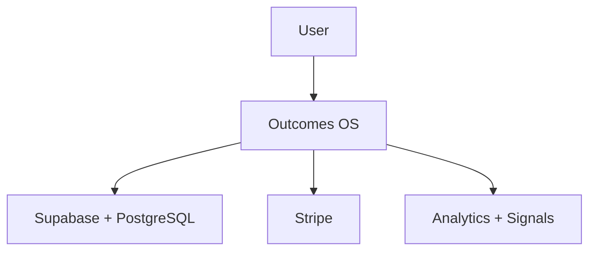

# Outcomes OS Architecture

Outcomes OS is a production web application built around a modern managed stack. The architecture supports authenticated execution workflows, durable user data, subscriptions, behavioral signals, analytics, and guided review.

This showcase intentionally documents the platform at a high level. Private implementation details, secrets, database targets, and production controls remain in the authoritative application repository and verified infrastructure.

## Public product boundary

- [outcomesos.com](https://outcomesos.com) owns public positioning, education, SEO, and conversion.
- [app.outcomesos.com](https://app.outcomesos.com) owns authentication and the product experience.
- The authenticated application deploys from GitHub through Vercel.
- Cloudflare provides DNS and edge services for the custom domain.

## High-level components

- **Next.js App Router** provides the application interface and server workflows.
- **TypeScript and React** support the user experience and product logic.
- **Supabase** provides authentication and managed backend services.
- **PostgreSQL** stores durable product and execution data.
- **Stripe** manages subscription and billing workflows.
- **Analytics and behavioral signals** support product learning and execution insights.
- **Vercel** runs the production application.
- **Cloudflare** manages the custom-domain edge layer.

## High-level flow

Provider identity and infrastructure ownership must be verified directly before any production change. Edge response headers alone do not establish the application origin.
